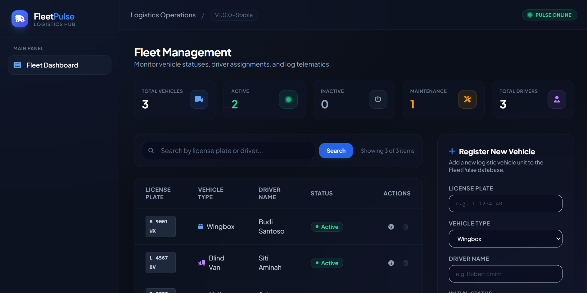
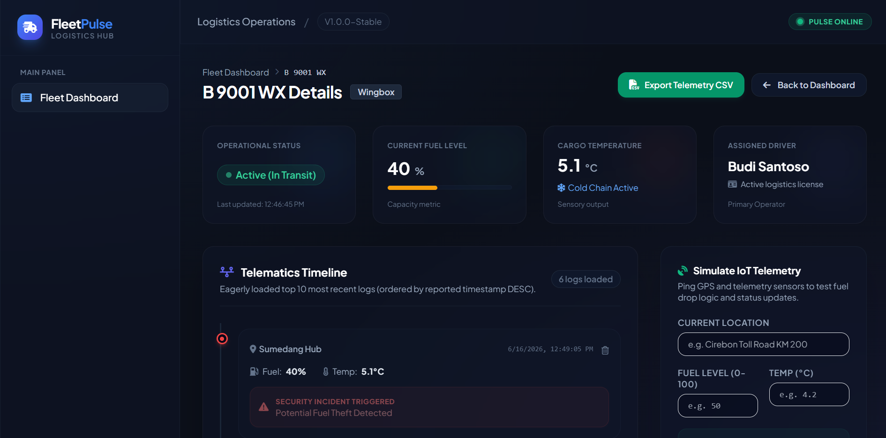
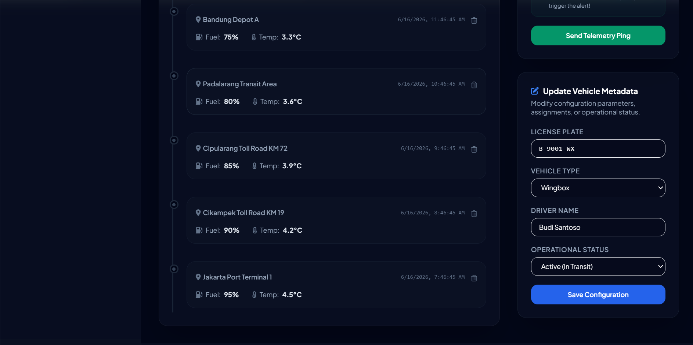

# FleetPulse — Smart Logistics & Fleet Tracking Management Panel

FleetPulse is a production-grade, highly scalable Monolith Modern MVC (Model-View-Controller) Web Application and Telemetry Ingestion Hub built with **NestJS**, **TypeScript**, and **Domain-Driven Design (DDD)** principles. It manages logistics fleet assignments and ingests real-time IoT sensory data (location, fuel, temperature), automatically triggering theft security alerts on sudden fuel drops.

---

## Architecture & Design Highlights

1. **Strict MVC Pattern**:
   - **Model**: Represented by TypeORM Entities mapped to a local SQLite database.
   - **View**: Rendered server-side using **EJS (Embedded JavaScript)** templates utilizing `@nestjs/platform-express`. Styled with a high-density, modern glassmorphic theme powered by **Tailwind CSS**.
   - **Controller**: Acts as the centralized traffic router, coordinating services and routing requests.

2. **Feature-Based Module Structure**:
   - `AuthModule`: Manages web session credentials, logout flows, and API keys validation.
   - `FleetModule`: Governs vehicle registration, status updates, and soft deletions.
   - `TrackingModule`: Ingests IoT GPS/Sensory logs, updates vehicle statuses, and implements incident alerts.
   - `SeedModule`: Checks schema contents at startup and injects base test fixtures automatically.

3. **Transparent Hybrid Controller Endpoints**:
   - All data-mutating operations (`Create`, `Update`, `Delete`) act as hybrid routers.
   - If the request has an `/api` prefix or the header `Accept: application/json` is sent, the controller responds with structured REST API JSON.
   - Otherwise, standard web browser form submissions are processed, and the browser is seamlessly redirected back to the appropriate EJS dashboard views.

4. **Dual Authentication Guard**:
   - **Web Panel**: Managed via stateful, secure cookie sessions (`express-session` with `cookie-parser`). Redirects unauthorized requests directly to the `/login` view.
   - **REST API Clients**: Protected via an API Key validator (`x-api-key` header checked against `FleetPulseSecretKey123`), making integration testing via Postman simple and stateless.

5. **Contextual Exception Filtering**:
   - A global `GlobalExceptionFilter` intercepts all HTTP and application exceptions.
   - For web browsers, it redirects unauthorized actions to `/login` or renders a custom premium `error.ejs` template (preventing raw stack trace leaks).
   - For REST clients, it responds with clean JSON payloads: `{ statusCode, timestamp, path, message }`.

---

## Database Schema Model (1:N Relationship)

Below is the entity-relationship design showing the One-to-Many connection between a Fleet vehicle and its telemetry logs:

```
  +---------------------------------------+
  |                 users                 |
  +---------------------------------------+
  | id (PK)           : UUID              |
  | username          : String (Unique)   |
  | passwordHash      : String            |
  | created_at        : Date              |
  +---------------------------------------+

  +---------------------------------------+
  |                fleets                 |
  +---------------------------------------+         1
  | id (PK)           : UUID              | <---------------+
  | license_plate     : String (Unique)   |                 |
  | vehicle_type      : Enum              |                 |
  | driver_name       : String            |                 |
  | status            : Enum              |                 |
  | created_at        : Date              |                 |
  | updated_at        : Date              |                 |
  | deleted_at        : Date (Nullable)   |                 |
  +---------------------------------------+                 |
                                                            |
                                                            | Many (1:N)
                                                            |
  +---------------------------------------+                 |
  |             tracking_logs             |                 |
  +---------------------------------------+                 |
  | id (PK)           : UUID              | <---------------+
  | fleet_id (FK)     : UUID              |
  | current_location  : String            |
  | fuel_level        : Integer (0-100)   |
  | temperature       : Float (Celsius)   |
  | alert             : String (Nullable) |
  | reported_at       : Date              |
  +---------------------------------------+
```

---

## Core Dependencies

- `@nestjs/common`, `@nestjs/core`, `@nestjs/platform-express` (Framework core)
- `@nestjs/typeorm`, `typeorm`, `sqlite3` (Database schema, persistence, and SQLite integration)
- `class-validator`, `class-transformer` (Validation schemas for DTO inputs)
- `express-session`, `cookie-parser` (Stateful session security)
- `ejs` (Server-side rendering templates engine)
- `tailwindcss` (CDN integration inside layouts)

---

## Getting Started

### 1. Installation

Clone the repository and install the dependencies:
```bash
npm install
```

### 2. Building and Running

Compile the TypeScript source and run the application:
```bash
# Build the application
npm run build

# Start the server (runs on port 3000)
npm run start
```
*Note: On the very first run, the SQLite database (`database.sqlite`) is created and populated with test data instantly.*

### 3. Pre-seeded Credentials

- **Admin Web Panel**:
  - URL: `http://localhost:3000/login`
  - Username: `admin`
  - Password: `adminPassword123`
- **API Clients / Postman**:
  - Header: `x-api-key: FleetPulseSecretKey123`

---

## Postman / API Client Testing Guide

> [!TIP]
> We have included a pre-configured Postman Collection file [fleet-pulse.postman_collection.json](fleet-pulse.postman_collection.json) in the root directory of this project. You can import this file directly into Postman to test the entire API instantly.

Below are the endpoints available to query or mutate the logistics system:

### 1. Retrieve Fleets (Paginated)
- **Method**: `GET`
- **URL**: `http://localhost:3000/api/fleets?page=1&limit=5&search=Budi`
- **Headers**:
  - `x-api-key: FleetPulseSecretKey123`
  - `Accept: application/json`

### 2. Retrieve Fleet Details (Eager Loads Top 10 Logs)
- **Method**: `GET`
- **URL**: `http://localhost:3000/api/fleets/:id`
- **Headers**:
  - `x-api-key: FleetPulseSecretKey123`
  - `Accept: application/json`

### 3. Create Fleet (Validation & License Plate Uniqueness)
- **Method**: `POST`
- **URL**: `http://localhost:3050/api/fleets` (or port `3000`)
- **Headers**:
  - `x-api-key: FleetPulseSecretKey123`
  - `Content-Type: application/json`
  - `Accept: application/json`
- **Payload**:
  ```json
  {
    "license_plate": "B 9005 XYZ",
    "vehicle_type": "Blind Van",
    "driver_name": "Johnny Cage",
    "status": "Inactive"
  }
  ```

### 4. Update Fleet
- **Method**: `PATCH`
- **URL**: `http://localhost:3000/api/fleets/:id`
- **Headers**:
  - `x-api-key: FleetPulseSecretKey123`
  - `Content-Type: application/json`
  - `Accept: application/json`
- **Payload**:
  ```json
  {
    "driver_name": "Johnny Cage Jr.",
    "status": "Active"
  }
  ```

### 5. Delete Fleet (Safety validation: status must not be 'Active')
- **Method**: `DELETE`
- **URL**: `http://localhost:3000/api/fleets/:id`
- **Headers**:
  - `x-api-key: FleetPulseSecretKey123`
  - `Accept: application/json`

### 6. Ingest Telemetry Log (Fuel theft simulation)
- **Method**: `POST`
- **URL**: `http://localhost:3000/api/tracking-logs`
- **Headers**:
  - `x-api-key: FleetPulseSecretKey123`
  - `Content-Type: application/json`
  - `Accept: application/json`
- **Payload**:
  ```json
  {
    "fleet_id": "YOUR-FLEET-UUID-HERE",
    "current_location": "Toll Road KM 90 rest area",
    "fuel_level": 45,
    "temperature": 5.4
  }
  ```
*Hint: If this fuel level drops by more than 30% relative to the last log, the JSON response includes `"alert": "Potential Fuel Theft Detected"` and writes this indicator directly into the database for timeline rendering.*

### 7. Delete Telemetry Log
- **Method**: `DELETE`
- **URL**: `http://localhost:3000/api/tracking-logs/:id`
- **Headers**:
  - `x-api-key: FleetPulseSecretKey123`
  - `Accept: application/json`

---

## Application Layout Preview

Below is the user interface (UI) preview of the FleetPulse management panel:

### 1. Fleet Management Dashboard


### 2. Fleet Statistics Dashboard


### 3. Fleet Telemetry & Tracking Timeline

